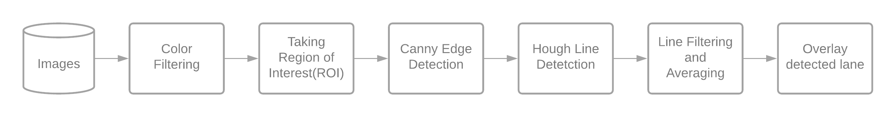
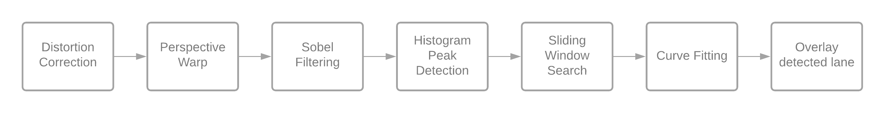

# Vision-Based-Robust-Lane-Detection-and-Prediction

#### DIGITAL IMAGE PROCESSING


AAYUSH NEELKANTH  aayush27_soe@jnu.ac.in <br>
BHAVISHYA RAJ  bhavis58_soe@jnu.ac.in <br>

## AIM
To make a Vision-Based – Robust Lane Detection and Prediction System. 


<a href = "https://www.kaggle.com/borismarjanovic/price-volume-data-for-all-us-stocks-etfs"><h4>DATASET DESCRIPTION</h4> </a>

Data is presented in txt format that we will convert it into a csv file. It includes attributes such as Date, Open, High, Low, Close, Volume, OpenInt. A lot of Ups and Downs in the value of Stocks and ETFs are present in the Dataset therefore we have a very wide variety of Database which we will perform to train and test our Model.


## CHALLENGES

In a basic lane detection system, we usually take a triangular or trapezoidal region-of-interest. But there are a lot of disadvantages to it; not being able to detect the lane when road curves, is one of the first that come to our minds. While building a robust lane detection system, there are a lot of challenges that we faced. To specify, a few are as follows:
- Adapting to changing curvatures of the road.
-	Adapting to changing terrains.
-	Making room for discontinuities in lane such as potholes, and withering lane lines.
-	Predicting lanes when a vehicle comes in place as to where the lane should be.
-	Being vision-based, also adapting to lighting changes on the road.


## PROGRESS

In any driving scenario, lane lines are an essential component of indicating traffic flow and where a vehicle should drive. We will be building this lane detection system in OpenCV using Python.

<a href = "https://github.com/brobotan/Vision-Based-Robust-Lane-Detection-and-Prediction/blob/main/simple-lane-detection/Simple.ipynb"><h4>Simple Lane detection</h4> </a>
The structure of our simple lane detection pipeline:

This lane detection system is far from perfect; it was our first versions. It can't detect lanes outside of perfect conditions, and can only detect straight lines.


<a href = "https://github.com/brobotan/Vision-Based-Robust-Lane-Detection-and-Prediction/blob/main/curved-lane-detect/curved-lane-detect.ipynb"><h4>Curved Lane detection</h4> </a>
We developed a very simple lane detection system that could detect straight lane lines in an image. It worked decently under perfect conditions; however, it would fail to detect curved lanes accurately and was not robust to obstructions and shadows. This version im-proves upon both of these limitations. The structure of our simple lane detection pipeline:

It works much better than the previous version, and it even handles curved lanes! Howev-er, it still does get affected by shadows and drastic changes in road texture to some extent.


```
▪The End
```
