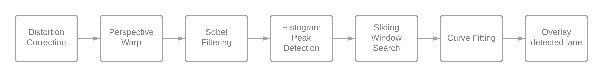

# Curved Lane Detection
---
We developed a very simple lane detection system that could detect straight lane lines in an image. It worked decently under perfect conditions; however, it would fail to detect curved lanes accurately and was not robust to obstructions and shadows. This version im-proves upon both of these limitations. The structure of our simple lane detection pipeline:

It works much better than the previous version, and it even handles curved lanes! Howev-er, it still does get affected by shadows and drastic changes in road texture to some extent.

